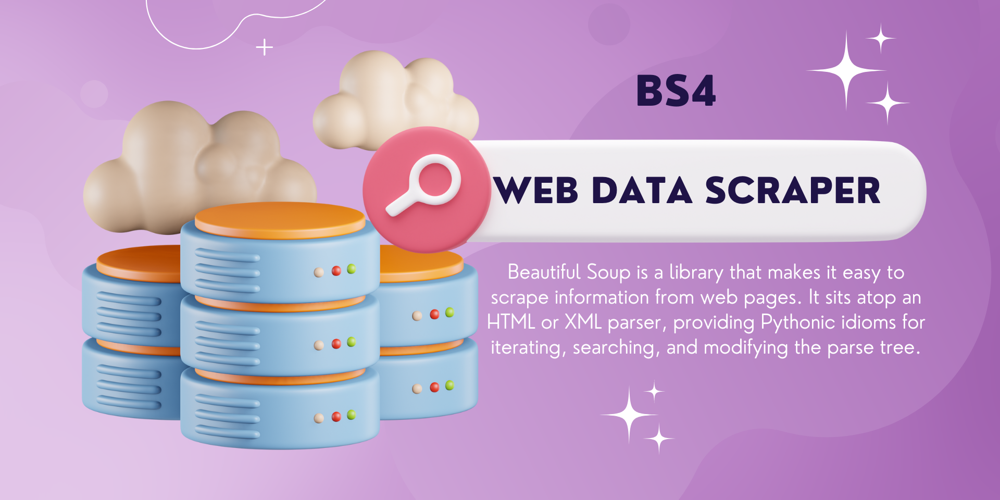
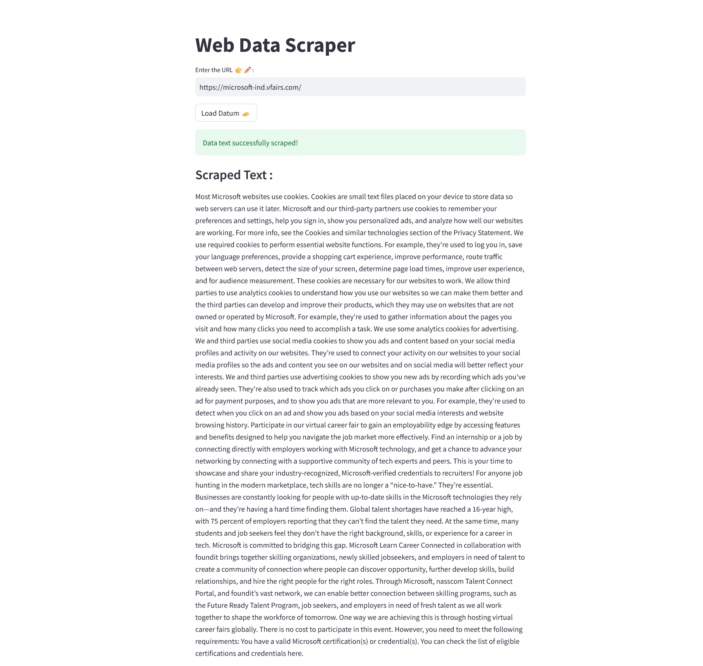

🚀Check out the configuration reference at https://huggingface.co/docs/hub/spaces-config-reference

🚀Huggingface Spaces : https://huggingface.co/spaces/prithivMLmods/Web-Data-Scraper

🚀Docs for Space clone : git clone https://huggingface.co/spaces/prithivMLmods/Web-Data-Scraper

## 🔮Entered URL of Microsoft Learn :

.

.

## 🎴The Scraped Result in the Space : 

.

.

.

## Python Package Index PyPI

| Library Name | Version |
| --- | --- |
| aiohttp | 3.8.5 |
| aiosignal | 1.3.1 |
| altair | 5.0.1 |
| async-timeout | 4.0.2 |
| attrs | 23.1.0 |
| beautifulsoup4 | 4.12.2 |
| blinker | 1.6.2 |
| bs4 | 0.0.1 |
| cachetools | 5.3.1 |
| certifi | 2023.7.22 |
| charset-normalizer | 3.2.0 |
| click | 8.1.6 |
| decorator | 5.1.1 |
| frozenlist | 1.4.0 |
| gitdb | 4.0.10 |
| GitPython | 3.1.32 |
| idna | 3.4 |
| importlib-metadata | 6.8.0 |
| Jinja2 | 3.1.2 |
| jsonschema | 4.18.4 |
| jsonschema-specifications | 2023.7.1 |
| markdown-it-py | 3.0.0 |
| MarkupSafe | 2.1.3 |
| mdurl | 0.1.2 |
| multidict | 6.0.4 |
| numpy | 1.25.2 |
| openai | 0.27.8 |
| packaging | 23.1 |
| pandas | 2.0.3 |
| Pillow | 9.5.0 |
| protobuf | 4.23.4 |
| pyarrow | 12.0.1 |
| pydeck | 0.8.0 |
| Pygments | 2.15.1 |
| Pympler | 1.0.1 |
| python-dateutil | 2.8.2 |
| python-dotenv | 1.0.0 |
| pytz | 2023.3 |
| pytz-deprecation-shim | 0.1.0.post0 |
| referencing | 0.30.0 |
| requests | 2.31.0 |
| rich | 13.5.2 |
| rpds-py | 0.9.2 |
| six | 1.16.0 |
| smmap | 5.0.0 |
| soupsieve | 2.4.1 |
| streamlit | 1.25.0 |
| tenacity | 8.2.2 |
| toml | 0.10.2 |
| toolz | 0.12.0 |
| tornado | 6.3.2 |
| tqdm | 4.65.0 |
| typing-extensions | 4.7.1 |
| tzdata | 2023.3 |
| tzlocal | 4.3.1 |
| urllib3 | 2.0.4 |
| validators | 0.20.0 |
| watchdog | 3.0.0 |
| yarl | 1.9.2 |
| zipp | 3.16.2 |</s>

## Make sure about the Lib's 

+ StreamLit
+ Requests 
+ BS4
