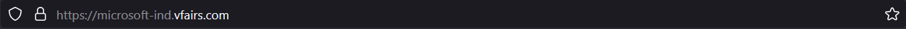

🚀Check out the configuration reference at https://huggingface.co/docs/hub/spaces-config-reference

🚀Huggingface Spaces : https://huggingface.co/spaces/prithivMLmods/Web-Data-Scraper

🚀Docs for Space clone : git clone https://huggingface.co/spaces/prithivMLmods/Web-Data-Scraper

## 🔮Entered URL of Microsoft Learn :

.

.

## 🎴The Scraped Result in the Space : 

.

.

.

## Python Package Index PyPI

